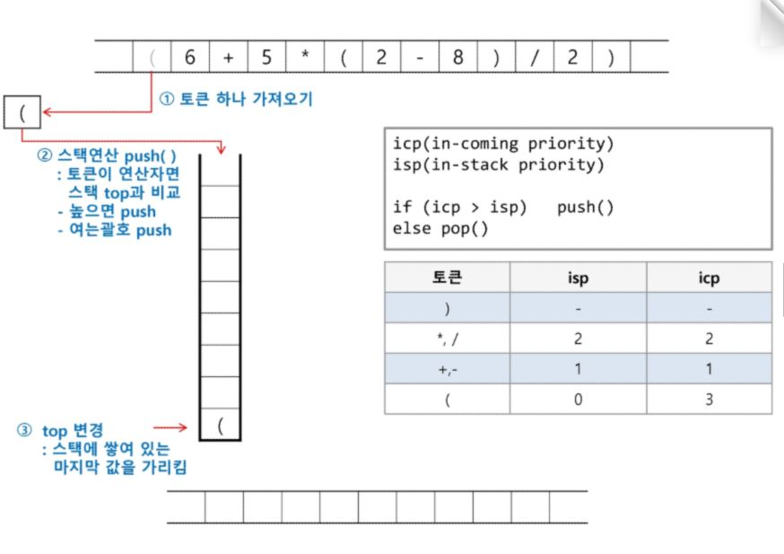
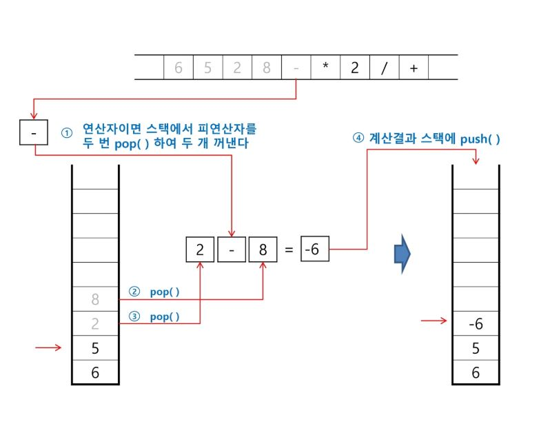
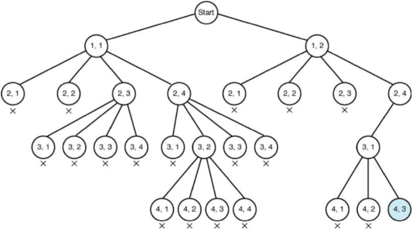
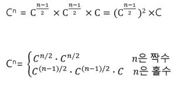

# Stack02

## 1. stack 활용 (계산기)

> 중위 표기법 : 연산자를 피연산자의 가운데 표기하는 방법 ex) A+B
>
> 후위 표기법 : 연산자를 피연산자의 뒤에 표기하는 방법 ex) AB+

1. 중위 표기법에서 후위 표기법으로 변환

   

2. 후위 표기법에서 중위 표기법으로 변환

   

## 2. 백트래킹(Backtracking)

* 해를 찾는 도중에 막히면 되돌아가서 다시 해를 찾아가는 기법이다.(취소!!)

* 최적화(optimization)문제와 결정(decision)문제를 해결할 수 있다. => 미로찾기, n-Queen, Map coloring, 부분 집합의 합

* 백트래킹과 DFS의 차이

  * 어떤 노드에서 출발하는 경로가 이어질것 같지 않으면 그 경로를 찾지 않음(가지치기)
    * 가지치기 : 유망하지 않은 노드가 포함되는 경로는 더이상 고려하지 않음
  * 불필요한 경로를 조기에 차단
  * 일반적으로 백트래킹을 적용하면 경우의 수가 줄어들지만 최악의 경우에는 지수함수 시간을 필요하므로 처리 불가

* 백트래킹을 이용한 알고리즘 활용 순서

  1. 상태공간 트리의 깊이 우선 검색 실시

  2. 각 노드가 유망한지 점검

  3. 그 노드가 유망하지 않으면 그 노드의 부모 노드로 돌아가 검색 실시

     

### 부분집합

> backtracking을 활용하여 부분집합 구하기

```python
arr ='ABC'
bits = [0]*len(arr)
for i in range(2):
    bits[0] = i
    for j in range(2):
        bits[1] = j
        for k in range(2):
            bits[2] = k
            print(bits)
```

```python
def subset(k,n): # N : 해야할 선택의 수(단말노드의 높이), k : 현재 선택한 선택수(현재 노드의 높이)
    if k == n: # 단말 노드에 도착(모든선택이 완료)
        print(bits)
        return
    bits[k] = 1;subset(k+1, n) # 왼쪽
    bits[k] = 0;subset(k+1, n) # 오른쪽
    else:
        for in range(k, n):
            subset()

arr ='ABC'
bits = [0]*len(arr)    
subset(0, N)
```

```python
def subset(n):
    if len(stack) == n:  # 하나의 순열 완성
        for i in range(N):
            print(arr[stack[i]], end='')
        print()
        return
    else:
        for i in range(n):
            if not used[i]:
                stack.append(i)
                used[i] = 1
                subset(n)
                stack.pop()
                used[i] = 0

                
arr = 'ABC'
N = len(arr)
used = [0] * N
stack = []
subset(N)  # N : 전체원소수
```


```python
def subset(k, n, used):
    if k == n:  # 하나의 순열 완성
        for i in range(N):
            print(arr[order[i]], end='')
        print()
        return
    for i in range(n):
        if used & (1 << i):
            continue
        order[k] = i
        subset(k + 1, n, used | (1 << i))


arr = 'ABC'
N = len(arr)
order = [0] * N
subset(0, N, 0)                # 0: 선택한수, N : 전체원소수, 0: 선택한 요소들의 집합
```


## 2. 분할정복

> 해결할 문제를 여러개의 작은 부분으로 나눈후 문제들을 각각 해결하여 해결된 답을 모으는 방법

### 거듭제곱



```python
def Power(base, Exponent):
    if not Exponent or not base:
        return 1
    if not Exponent % 2:
        newbase = Power(base, Exponent/2)
        return newbase * newbase
    else:
        newbase = Power(base, (Exponent-1)/2)
        return newbase * newbase * base
```

### 최소값 찾기

```python
def getMin(lo, hi): # lo : 범위의 시작, hi : 범위의 끝
    if lo == hi:
        return arr[lo]
    mid = (lo + hi) >> 1
    return min(getMin(lo, mid), getMin(mid + 1, hi))

arr = [6, 4, 2, 5, 1, 9, 2, 11, 8, 7]
print(getMin(0, min(arr)-1))
```

### 퀵 정렬

> 피봇 설정 후 분할된 값들을 정렬
>
> 여기있는 방법은 효율적인 방법이 아니당

1. 피봇 설정

   ```python
   def partition(a, begin, end):
       pivot = (begin + end) // 2
       L = begin
       R = end
       while L < R:
           while(a[L] < a[pivot] and L < R) : L += 1
           while(a[R] >= a[pivot] and L < R) : R -= 1
           if L < R:
               if L == pivot: pivot = R
                   a[L], a[R] = a[R], a[L]
       a[pivot], a[R] = a[R], a[pivot]
       return R
   ```

   

2. 분할정렬

   ```python
   def quicSort(a,begin,end):
       if begin < end:
           p = partition(a,begin,end)
           quickSort(a,begin,p-1)
           quickSort(a,p+1,end)
   ```

   

