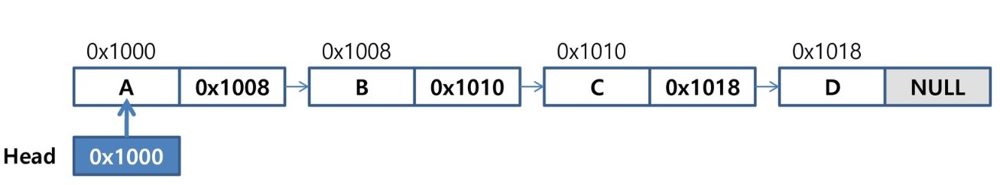

# List(연결 리스트)

> 순서를 가진 데이터의 집합, 동일한 데이터를 가지고 있어도 상관 없음
>
> 같은 크기의 동일한 자료형(c 기준)

## 1. 순차 List

### 1. List의 종류

1. 순차 리스트 : 배열을 기반으로 구현된 리스트
2. 연결 리스트 : 메모리의 동적할당을 기반으로 구현된 리스트

### 2. 순차 List의 주요 기능 구현

1. List의 앞쪽에 원소 추가
2. List의 뒤쪽에 원소 추가`.append()`
3. List의 특정 위치에 원소 추가(삽입연산)`.add()`
4. List의 특정 위치에 있는 원소 삭제(삭제연산)`.remove()`
5. List의 특정 위치에 있는 원소를 리턴`.pop()`

### 3. 순차 List의 문제점

1. 자료의 삽입/삭제 과정에서 원소들을 이동시키는 작업이 필요해 시간이 크게 필요하다.
2. 배열의 크기가 정해져 있을 경우 너무 크게 할당하면 메모리의 낭비가 발생하며 반대로 너무 적게 할당 하면 overflow가 발생하거나 새롭게 배열을 만들어 작업해야함.

## 2. 연결 List(Linked List)

### 1. 연결 List란?

1. 순차 List와는 다르게 메모리 상 물리적인 순서가 일치 하지 않는다.
2. 링크를 통해 원소에 접근하므로, 순차 List처럼 원소를 이동시키는 작업이 필요하지 않는다.
3. 배열의 크기를 정하지 않고 자료구조의 크기를 동적으로 조정하여 메모리의 효율적인 사용이 가능하다.

### 2. 연결 List의 구조



1. 구성 요소

   * 노드(Node) : 연결 List에서 하나의 원소에 필요한 데이터를 갖고 있는 자료 단위
     * 데이터 필드 : 원소의 값을 저장, 저장할 원소의 종류나 크기에 따라 
     * 링크 필드 : 다음 노드의 주로를 저장하는 자료구조
   * 헤드(Head) : List의 처음 노드를 나타내는 레퍼런스

2. 연결 구조

   * 노드가 링크 필드에 의해 다음 노드로 연결도는 구조를 가진다.
   * **헤드가 가장 앞 노드를 가리키고 링크 필드가 다음 노드를 가리킨다.**
   * **최종적으로 링크 필드가 Null인 노드가 리스트의 가장 마지막 노드가 된다.**

3. [단순 연결 List 구현](./LinkedList 실습)
1. 삽입 연산
      1. 메모리를 할당하여 새로운 노드 생성
      2. 삽입될 위치 바로 앞에 위치한 노드의 링크 필드 복사
      3. 새로운 노드의 주소를 앞 노드의 링크 필드에 저장
   2. 삭제 연산
      1. 삭제할 노드의 앞 노드 탐색
      2. 삭제할 노드의 링크 필드를 선행 노드의 링크 필드에 복사

## 3. 삽입 정렬(Insertion Sort)

1. 정렬 과정

   * 정렬할 자료를 정렬된 원소와 정렬되지 않은 원소로 구분
   * 정렬되지 않은 부분 집합의 원소를 하나 씩 꺼내서 이미 정렬 되어있는 부분 집합의 마지막 원소부터 비교하면서 삽입

2. 시간 복잡도

   * O(n^2)

3.  구현

   ```python
   arr = [69, 10, 30, 2, 16, 8, 31, 22]
   N = len(arr)
   # 삽입하는 작업을 n-1번 반복 (1~n-1)
   for i in range(1, N):
       tmp = arr[i]
       j = i -1
       while j >= 0 and tmp < arr[j]:
           arr[j+1] = arr[j]
           j -= 1
       arr[j + 1] = tmp
   ```

   

## 4. 병합 정렬(Merge Sort)

1. 정렬 과정

   * 여러 개의 정렬된 자료의 집합을 병합하여 한 개의 정렬된 집합으로 만드는 방식
   * 분할 정복 알고리즘을 활용하여 최소 단위 까지 문제를 나눈 후에 차례대로 정렬하여 최종 결과를 얻어낸다.

2. 시간 복잡도

   * O(n log n)

3. 구현

   ```python
   def mergeSort(arr):
       if len(arr) <= 1:
           return arr
       mid = int(len(arr) / 2)
       left = arr[:mid]
       right = arr[mid:]
   
       left = mergeSort(left)
       right = mergeSort(right)
   
       result = []
       while len(left) > 0 and len(right) > 0:
           if left[0] < right[0]:
               result.append(left.pop(0))
           else:
               result.append(right.pop(0))
       if len(left) > 0:
           result += left
       else:
           result += right
       return result
   ```

   ```python
   def mergeSort(lo, hi):
       if lo >= hi:
           return
   
       mid = (lo + hi) >> 1
       mergeSort(lo, mid)
       mergeSort(mid + 1, hi)
   
       i, j, k = lo, mid + 1, lo
       while i <= mid and j <= hi:
           if arr[i] < arr[j]:
               sort[k] = arr[i]
               k, i = k + 1, i + 1
           else:
               sort[k] = arr[j]
               k, j = k + 1, j + 1
       while i <= mid:
           sort[k] = arr[i]
           k, i = k + 1, i + 1
       while j <= hi:
           sort[k] = arr[j]
           k, j = k + 1, j + 1
       for i in range(lo, hi + 1):
           arr[i] = sort[i]
   ```