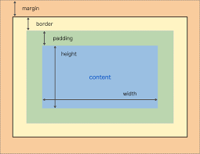

# CSS(Cascading Style Sheet)

## 1. [기본 사용법](01_css.html) -> [html](./01_css.html)

1. 기본 사용법

   ```css
   h1 {color:blue}
   ```

   * 셀렉터 : h1
   * 프로퍼티 : color
   * 값 : blue

2. 사용 위치

   * `인라인(inline)` : 재사용이 불가능하며 되도록 쓰지 말것
   
     ```html
     <p style="color: purple">인라인</p>
     ```
   
   * `내부참조(embed)` : header에서 사용되며 한 파일 내에서 재사용 가능
   
     ```html
     <head>
       <style>
           h1 {
           color: red;
         }
         </style>
     </head>
     ```
   
     * `외부참조` : 다른 파일에서도 재사용이 가능하며 가장 많이 쓰는 방법(외부에 css파일 만들어서)
   
     ```html
     <head>
         <link rel="stylesheet" href="01_style.css">
     </head>
     ```

## 2. [선택자(selector)](./02_style.css) -> [html](./02_selector.html)

적용하고자하는 요소에 접근 할 수 있다.

선택자는 우선순위가 있다.(`id` >`class`>`tag`)

 * `id`는 문서에서 반드시 한번만 등장할때 사용된다. `#id`
 * `class`는 문서에서 여러번 등장하여 사용된다. `.class`
 * `!important`는 CSS적용이 가장 우선된다. 그러므로 **사용에 주의하자!**

**선택자 세부 사용법**

 * `요소선택자` : 특정 태그명을 가진 엘리먼트 전체를 제어하기 위해서 사용 `요소`
   
   ```css
   div {
       height: 100px;
       width: 50px;
       border: 1px solid black;
   }
   ```
   
   태그의 이름을 사용하여 요소를 선택한다.
* `그룹선택자` : 여러 요소를 모아서 한번에 처리하고자 할 때 사용

  ```CSS
  h1, h2, h3, h4, h5, h6, .silver {
      color: silver;
       }
  ```

* `클래스 선택자` : 일련의 태그를 그룹핑해서 하나처럼제어하기 위해서 사용

  ```css
  .blue {
    background-color: blue;
  }
  ```

  class 속성에는 공백으로 구분된 여러개의 class가 표시될 수 있다.

  css선택자에서는 `.`을 사용해서 class임을 표시한다.

 * `아이디 선택자` : 전체 문서에서 하나의 태그를 식별하기 위해서만 사용

   ```css
   #green {
       background-color: green;
   }
   ```

   `#`을 사용해서 id임을 표시한다.

* `인접 선택자` : 인접 선택자 : 어떤 클래스가 구성된 이후 처리하고자 할 때 사용

  ```CSS
  .blue + .red + div {
    background-color: purple;
  }
  ```

* `자식 선택자` : 바로 밑에 있는 것을 처리할  때

  ```CSS
  .parent > li {
    color : red;
  }
  ```

 * `후손 선택자` : 하위 항목 모든것을 처리할 때

   ```CSS
   .ancestor li{
     color: blue;
   }
   ```

## 3. [단위](./03_style.css) -> [html](./03_unit.html)

1. `rem`/`em`

   * `rem` : root요소의 배수

     ```css
     ol, ol li {
       font-size: 2rem;
     }
     ```

     브라우저 요소의 기본이 16px라면 ol은 브라우저의 2배인 32px가 되며 li도 32px가 출력된다.

   * `em` : 상위 요소의 배수

     ```css
     ul, ul li {
       font-size: 2em;
     }
     ```

     브라우저 요소의 기본이 16px라면 ul은 브라우저의 2배인 32px가 되며 li은 ul의 2배인 64px가 출력된다.

2. `vw`, `vh`, `vmin`, `vmax`

   * `vw` : 좌우로 크기를 조정했을때 사용자의 화면에 맞게 조정 

     - 1vw = 1/1000 Viewidth

   * `vh` : 상하로 크기를 조정했을때 사용자의 화면에 맞게 조정

     * 1vh = 1/1000 Viewheight
   
   * `vmin`, `vmax` : 상하좌우를 조정했을때 최소 최대를 설정하고 사용자 화면에 맞게 조정
   
     ```css
     .vw {
       font-size: 10vw;
     }
     
     .vh {
       font-size: 10vh;
     }
     
     .div-vw {
       width : 10vw;
       height: 10vw;
       background-color: rgb(0, 0, 255);
     }
     
     .div-vh {
       width : 10vh;
       height: 10vh;
       background-color: rgba(0, 0, 255, 0.5);
     }
     
     .div-vmin{
       width : 10vmin;
       height: 10vmin;
       background-color: #0000ff;
     }
     ```

## 4. [Box모델링](04_style.css) -> [html](./04_box_model.html)



`Box`는 4가지 요소로 구성된다.

1. `margin` : 박스의 외각 공백

   ```css
   .margin {
     margin-top: 30px;
     margin-bottom: 30px;
     margin-right: 10px;
     margin-left: 10px;
   }
   
   .margin-shorthand-1 {
     /* 상하좌우 */
     margin: 10px;
   }
   
   .margin-shorthand-2 {
     /* 상하 / 좌우 */
     margin: 10px 20px;
   }
   
   .margin-shorthand-3 {
     /* 상 / 좌우 / 하 */
     margin : 10px 20px 30px;
   }
   
   .margin-shorthand-4 {
     /* 상 / 우 / 하 / 좌 - 시계방향 */
     margin : 10px 20px 30px 40px;
   ```

   `margin`을 관리하는 법은 위 코드와 같다.

   top, bottom, right, left를 넣지 않고(shorthand)  `margin`의 크기를 관리할 수 있는데 순서는 위 코드와 같다.

2. `border` : 박스의 윤곽선

   ```css
   .border {
     border-width: 2px;
     border-style: dotted;
     border-color: red;
     border-top-color: blue;
     border-radius: 10%;
   }
   ```

   border의 너비, 스타일, 색깔, 모양 등을 관리 할 수 있다.

3. `padding` : 박스 내부에서 `content`와 `border`사이의 공백

   ```python
   .padding {
     padding-top: 30px;
     padding-bottom: 30px;
     padding-right: 10px;
     padding-left: 10px;
   }
   ```

   `padding`을 관리하는 법은 위 코드와 같다.

   `margin`과 마찬가지로 `padding`의 크기를 관리할 수 있으며 `margin`과 동일하다.

4. `context` : 박스 내부 내용이 들어가는 곳

## 5. [Display 01 - `Block` 정렬 & `Inline`](./05_style.css) -> [html](./05_display.html)

1. block 및 block정렬

   * `block`은 기본적으로 가질 수 있는 영역의 100%를 가진다.(자동 줄바꿈)

   * h1~h5, p, div, form, table, ol, ul, li은 기본적으로 `block`을 가지고 있다.

   * 자동 줄바뀜이란 특성 때문에 `block`은 가로 정렬시 매우 쉽다.

   * 세로 정렬시 `block` 속성으로 인해 위치를 html문서에서 위치를 바꿔줘야한다.

   * block내부를 text를 가운데 정렬하고 싶다면 `text-aling: center;`을 활용한다.

   * text의 세로 또한 가운데 정렬 하고 싶다면 `line-height`를 블록 높이 만큼 주어 세로 가운데 정렬을 한다.

     ```css
     .mr-auto {
       margin-right: auto;
     }
     
     .ml-auto {
       margin-left: auto;
     }
     
     .mx-auto {
       margin: 0 auto;
     }
     ```

     위코드는 각각 왼쪽 맞춤, 오른쪽 맞춤, 양쪽 맞춤에 대한 코드이다.

2. `inline`
   
   * `block`과는 `inline`은 `content` 영역만큼 너비를 가진다.
   * `span`, `a`, `img` 등 이 기본적으로 `inline` 요소를 가지고 있다.

## 6. [Display 02 - 속성 변경 및 none과 hidden](./06_style.css) -> [html](./06_display_2.html)

1. `block`을 `inline`의 속성으로 바꿔주기

   * 이렇게 바꿔주면 block의 속성인 `width`와 `height`를 적용할 수 없게 된다. 즉 내용이 있어야 보일 수 있게 된다.

   ```css
   .inline {
     display: inline;
   }
   ```

2. `block`을 `inline-block`의 속성으로 바꿔주기

   * 이렇게 바꿔주면 `block`의 속성인 `width`와 `height`를 적용할 수 있고 `inline`의 속성인 우측 `margin`이 사라짐을 볼 수 있다.

   ```css
   .inline-block {
     display: inline-block;
   }
   ```

3. None

   * none을 사용하면 공간자체가 없어진다!

   ```css
   .none {
    display: none;
   }
   ```

4. hidden

   * hidden을 사용하면 공간은 유지되지만 보이지 않는다.

   ```css
   .hidden {
     visibility: hidden;
   }
   ```

## 7. [Postion](./07_style.css)  -> [html](./07_position.html)

1. static
   * 모든 태그들이 처음에 갖고 있는 상태이다.
   * 차례대로 왼쪽에서 오른쪽, 위에서 아래로 쌓인다.
   * `top` `right` `bottom` `left`요소를 쓸 수 없다!
   
2. absolute
   * absolute는 부모 혹은 조상요소를 기준으로 위치한다.(static이 아닌)
   * 만약 부모 혹은 조상중에 relative, absolute, fixed속성을 갖지 않는다면 가장 상위요소가 기준이 된다.
   
3. relative
   
   * relative는 자신이 static요소일 때 있어야 할 위치를 기준으로 이동한다.
   
4. fixed
   
   * fixed는 브라우저 위치에 따라 변경된다.
   
   ```css
   .absolute {
     position: absolute;
   }
   
   .relative {
     position: relative;
   }
   
   .relative-move {
     position: relative;
     top: 30px;
     left: 30px;
   }
   
   .fixed {
     position: fixed;
     bottom: 0;
   }
   ```
   
   

**말로 이해하기 힘들다면 예제코드를 통해 확인 할 수 있도록 하자. **

## 8. [float](./08_style.css) -> [html](./08_float.html)

* float는 기본적으로 둥둥 떠다니는 것이라 생각하면 이해하기 쉽다.(인라인 같아보이지만 인라인이랑 다름)

* 예제 코드를 통해 확인해 볼 수 있도록 하자.


## 9. [Background](./09_style.css) -> [html](./09_background.html)

요소들의 배경을 이용하여 꾸미고자 할 때 사용한다.

1. 이미지 크기

   사이즈는 px, cover, contain을 활용하여 배경의 크기를 결정한다.

   이미지 크기를 정했을 때 부족한 부분은 바둑판 형식 배치

   * px : width, height 순으로 지정가능
            값 하나만 저장하면, width 지정 + heigh : auto
   * cover : 배경이미지 크기의 비율을 고정
                  width height 중 큰 값을 배경 이미지에 맞춤.
                  보이지 않는 영역이 발생 가능
   * contain : 배경이미지 크기의 비율을 고정
     이미지가 보이지 않는 영역이 없도록 조정

   ```css
   background-size: 500px 500px;
   background-size: cover;
   background-size: contain;
   ```

   위와 같은 코드를 입력하여 제어한다!

2. 이미지 위치

   넣을 배경의 이미지를 조정한다.

   ```css
   background-position: center;
   background-position-y: 53%;
   background-position-y: bottom;
   ```

3. 한장만 넣기

   이미지 크기를 정했을 때 부족한 부분은 바둑판 형식으로 배치가 되는데 이를 막기 위해 다음과 같은 코드를 입력한다.

   ```css
   background-repeat: no-repeat
   ```


## 10. [Font](./10_style.css)  -> [html](./10_font.html)

1. 폰트 사이즈 조정

   `font-size`를 활용하며 조정하고 자세한 내용은 3. 단위를 참조하도록 하자.

2. 폰트 모양 조정

   `font-family`를 활용하여 조정하고 첫번째 폰트가 사용자의 컴퓨터에 없으면 다음 폰트가 나오게 된다.

   * 고딕체 : `font-family: Arial, Helvetica, sans-serif;`
   * 명조체 : `font-family: 'Times New Roman', Times, serif;`

3. 구글에서 폰트 받기

   1. [구글 폰트][https://fonts.google.com/]에 접속하여 원하는 언어의 원하는 폰트를 확인한다.

   2. 원하는 폰트를 HTML 문서와 CSS에 넣는다.

4. 폰트 굵기 조정

   `font-weight`를 활용하여 폰트의 굵기를 조정한다.

   ```css
   font-weight: lighter;
   font-weight: bolder;
   ```

5. 폰트 모양 조정

   `font-style`를 활용하여 폰트의 모양을 조정한다.

   ```css
   font-style: italic;
   ```

   